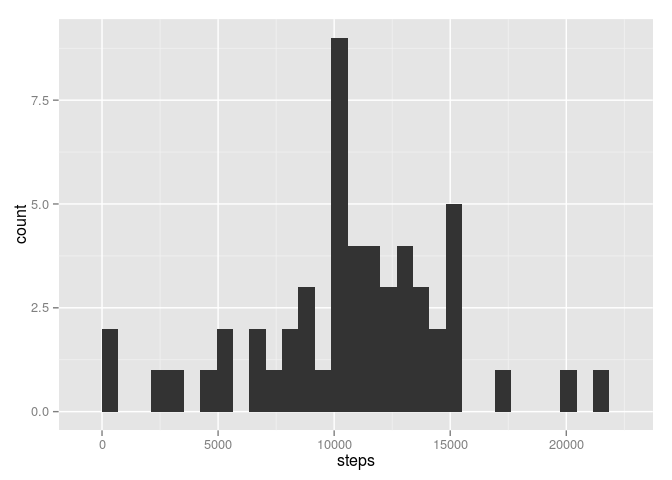
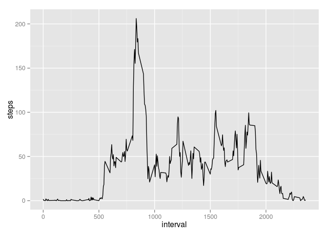
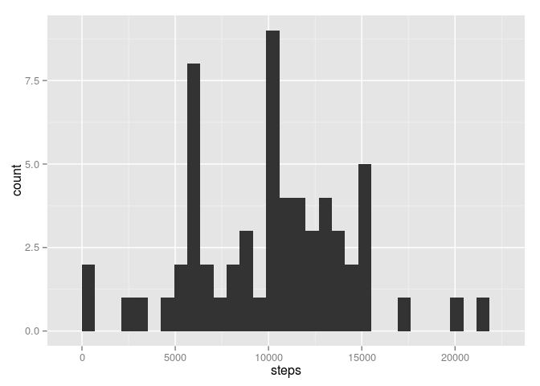
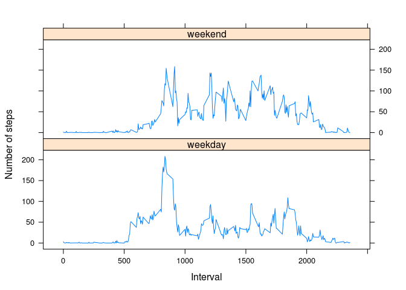

# Reproducible Research: Peer Assessment 1


```r
library(ggplot2)
library(impute)
library(lattice)
```


## Loading and preprocessing the data


```r
activity_data <- read.csv("activity.csv")
```


## What is mean total number of steps taken per day?


```r
activity_data_by_day <- aggregate(steps ~ date, data = activity_data, sum)
ggplot(activity_data_by_day, aes(x=steps)) + geom_histogram()
```

```
## stat_bin: binwidth defaulted to range/30. Use 'binwidth = x' to adjust this.
```

 

```r
mean(activity_data_by_day$steps, na.rm = TRUE)
```

```
## [1] 10766.19
```

```r
median(activity_data_by_day$steps, na.rm = TRUE)
```

```
## [1] 10765
```


## What is the average daily activity pattern?


```r
activity_data_by_interval <- aggregate(steps ~ interval, data = activity_data, mean)
ggplot(activity_data_by_interval, aes(interval, steps)) + geom_line()
```

 


```r
activity_data_by_interval[ which( activity_data_by_interval$steps == max(activity_data_by_interval$steps)),]$interval
```

```
## [1] 835
```

## Imputing missing values


```r
sum(is.na(activity_data$steps))
```

```
## [1] 2304
```


```r
activity_data_imputed <- data.frame( impute.knn(data.matrix( activity_data[c("steps", "interval")] ))$data )
```


```r
activity_data_imputed$date <- activity_data$date
activity_data_imputed_by_day <- aggregate(steps ~ date, data = activity_data_imputed, sum)
```


```r
ggplot(activity_data_imputed_by_day, aes(steps)) + geom_histogram()
```

```
## stat_bin: binwidth defaulted to range/30. Use 'binwidth = x' to adjust this.
```

 

```r
mean(activity_data_imputed_by_day$steps, na.rm = TRUE)
```

```
## [1] 10131.02
```

```r
median(activity_data_imputed_by_day$steps, na.rm = TRUE)
```

```
## [1] 10395
```

The imputed values slighty reduce the mean and the median steps of each day.

## Are there differences in activity patterns between weekdays and weekends?


```r
activity_data_imputed$date <- as.Date(strptime(activity_data_imputed$date, format="%Y-%m-%d"))
activity_data_imputed$day <- weekdays(activity_data_imputed$date)
for (i in 1:nrow(activity_data_imputed)) {
    if (activity_data_imputed[i,]$day %in% c("Saturday","Sunday")) {
        activity_data_imputed[i,]$day <- "weekend"
    } else {
        activity_data_imputed[i,]$day <- "weekday"
    }
}
activity_data_imputed_by_interval <- aggregate(steps ~ day + interval, data = activity_data_imputed, mean)
```


```r
xyplot(
    type="l",
    data=activity_data_imputed_by_interval,
    steps ~ interval | day,
    xlab="Interval",
    ylab="Number of steps",
    layout=c(1,2)
)
```

 
